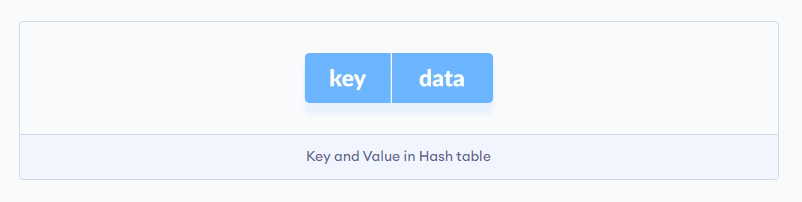
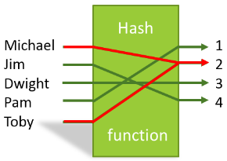
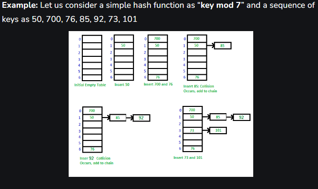
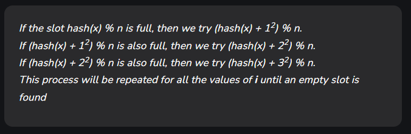
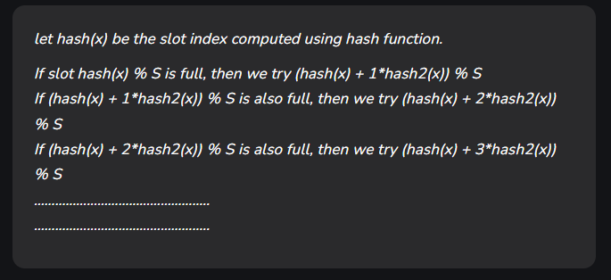

# Hash Table

The hash table has:
- Keys: used for indexing the values
- Value: Data that associates with keys

## Hasing function
In a hash table, a new index is processed using the keys. And, the element corresponding to that key is stored in the index. This process is called `hashing`.

## Hash collision ( hash function should be injective only)
When the hash function **generates the same index for multiple keys**, there will be a conflict (what value to be stored in that index). This is called a hash `collision`.

### Solution:
- Collision Resolution by chaining
- Open Addressing: Linear / quadratic probing and double hashing
## Collision Resolution by chaining
In chaining, if a hash function returns the `same index` for multiple elements, then these elements are stored in a `doubly linkedlist`.

## Open Addressing

### Linear Probing
>**ideas**: Sequentially start from the original location of the hash. If in the case that the current location has been already occupied, we search for the next location.

### Quadratic Probing
> **IDEAS**: Operate by taking the original hash index and adding successive values of an arbitrary quadratic polynomial until the slot is open.

### Double Hasing Function
>**IDEAS**: Reduced clustering, an optimized way. The increments of the probes is handled by another hash function.

## In conclusion:
- `Linear Probing` is simple to implement and fast, but it can lead to **clustering** and can degrade performance. Q
- `Quadratic` is more spaced out, but it can also lead to clustering and some slots are never checked out.
- `Double Hasing`: complex implementation, but can lead to more even distribution-> avoid clustering